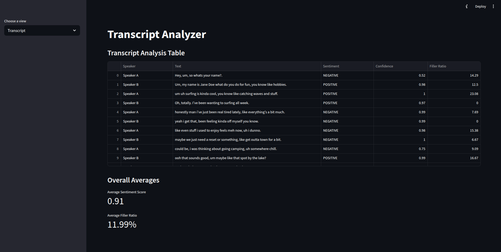

# Sentiment Analysis App

# Steps to Run:

For linux based:

`python3 -m venv venv `

`source venv/bin/activate`

`pip install -r requirements.txt`

`python -m spacy download en_core_web_sm`

# Run the app

`streamlit run app.py`

# Metrics

- Uses Hugging Face’s distilbert-base-uncased-finetuned-sst-2-english

- Returns Positive, Negative, or Neutral with a confidence score

- Calculates the percentage of filler words (like um, like, you know)

- Displays average sentiment score and average filler ratio across all dialogue lines

# Bonus

- Since I have prior experience using open-ai whisper, i added a bonus feature to record voice
  and have it analyzed

# One Extra Hour

- I would add a line chart visual of filler word fluctuation between speakers over the course of the dialogue

# Transcript View

-

# Audio Recording View

# Resources

https://docs.streamlit.io
https://docs.streamlit.io/develop/api-reference/status
https://docs.streamlit.io/develop/api-reference/media/st.audio
https://docs.streamlit.io/develop/api-reference/widgets/st.audio_input
https://huggingface.co/blog/sentiment-analysis-python
